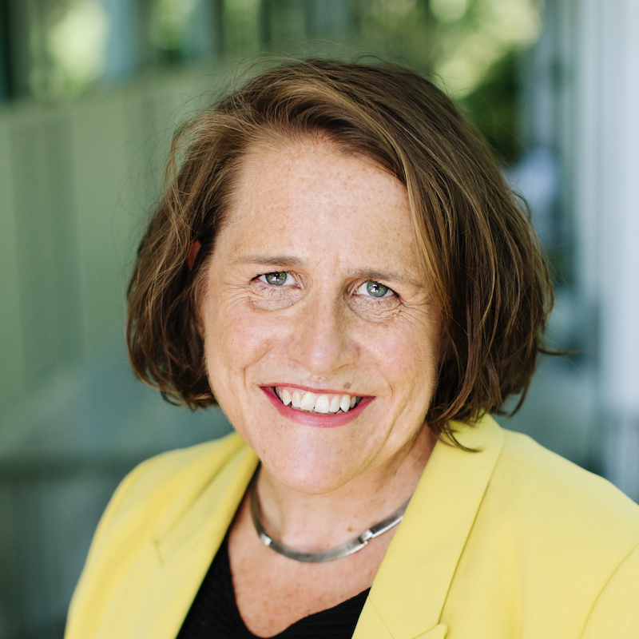

  <a href="{{ '/' | relative_url }}">Home</a> ·
  <a href="{{ '/cfp' | relative_url }}">Call for Papers</a> ·
  <a href="{{ '/dates' | relative_url }}">Important Dates</a> ·
  <a href="{{ '/programme' | relative_url }}">Programme</a> ·
  <a href="{{ '/keynote-speech' | relative_url }}"><strong>Keynote Speech</strong></a> ·
  <a href="{{ '/best-paper' | relative_url }}">Best Paper</a> ·
  <a href="{{ '/organizers' | relative_url }}">Organizers</a>

---

# Keynote Speech

  

**Speaker:** Prof. Claire Wardle

**Time:** 14.10-15.00

**Event:** Information Disorder Workshop (InDor), co-located with LREC 2026

**Title:** Revisiting the Information Disorder Framework: Reflecting on the use and relevance of definitions in our contemporary ecosystems

**Abstract:**

In 2017, Claire Wardle and Hossein Derakshan wrote a report for the Council of Europe, entitled ‘Information Disorder’. The frameworks laid out in the report has been used in different contexts globally, but in this talk, Wardle reflects on their usefulness. She considers whether they still have utility or whether they have simplified and limited the ways in which we understand the current challenges posed by contemporary information ecosystems.

**Bio:**

Claire Wardle is an Associate Professor in the Department of Communication at Cornell University. She is considered a leader in the field of misinformation, verification and user generated content.  In 2015, Claire co-founded the non-profit First Draft, a pioneer in innovation, research and practice in the field of misinformation.  She went on to co-found the Information Futures Lab at Brown University’s School of Public Health. Over the past decade she has developed an organization-wide training program for the BBC on eyewitness media, verification and misinformation, led social media policy at UNHCR, been a Fellow at the Shorenstein Center for Media, Politics and Public Policy at Harvard’s Kennedy School, and been the Research Director at the Tow Center for Digital Journalism at Columbia University’s Graduate School of Journalism. She has authored a number of articles and reports, including Information Disorder: An interdisciplinary Framework for Research and Policy for the Council of Europe and A Conceptual Analysis of the Overlaps and Differences between Hate Speech, Misinformation and Disinformation for the United Nation’s Department of Peace Operations. She holds a Ph.D. in Communication from the University of Pennsylvania.
